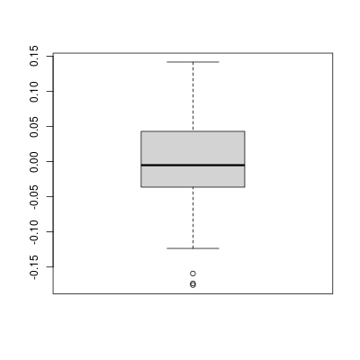
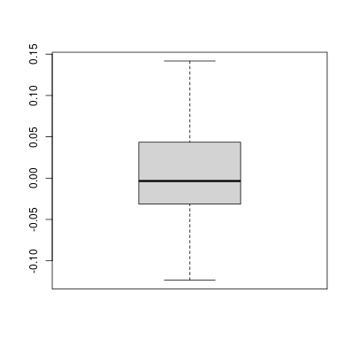
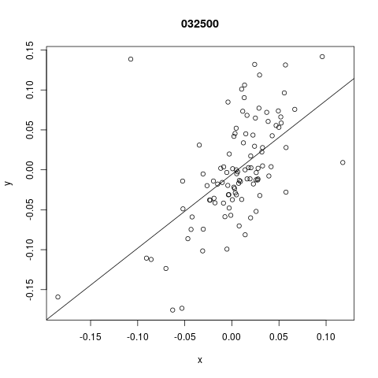
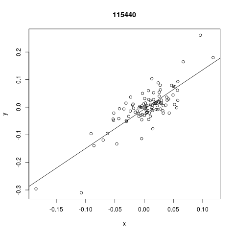

```{r setup, include=FALSE}
knitr::opts_chunk$set(warning = FALSE, echo = FALSE)
library(googledrive)
library(googlesheets4)
options(gargle_oauth_email = "hwanheehyeong@gmail.com")
drive_auth(email = "hwanheehyeong@gmail.com")
library(knitr)
library(kableExtra)
library(magrittr)
ss <- "https://docs.google.com/spreadsheets/d/1u3HyxY8kWwyqBpNDNZkMwUkktgVaF6wfpTf9NHYWCho/edit?usp=sharing"
Var <- read_sheet(ss,
                  sheet = "Var")
```

    
    

\newpage
    

**Important message**   
   

본 보고서에 수신인으로 기재되어 있지 않거나 SH회계법인이 제시한 Release Letter에 서명하여 회신하지 않은 경우,  본 보고서에 접근 권한이 없음을 알려드립니다.  

SH회계법인에 의해 본 보고서에 대한 접근이 허용되지 않았음에도 불구하고 본 보고서를 입수하여 그 내용을 확인하는 경우 다음 사항을 읽고 동의한 것으로 간주됩니다.  

- 본 평가인의 업무는 보고서 수신인의 이용 목적에 따라 보고서 수신인과 사전에 협의된 업무범위에 따라 수행되었으며 그 외 어떠한 다른 목적으로도 수행되지 않았습니다. 따라서 보고서 수신인 외의 자가 수행하여야 할 독립적인 조사의 대체적인 방법으로 사용될 수 없습니다.    
  
- 본 평가인은 보고서 수신인 이외 제 3자에 대하여 어떠한 주의의무를 부담하거나  수락하지 않습니다. 또한 SH회계법인은 보고서 수신인 이외 제 3자에 대하여 계약상 의무 또는 과실행위를 포함하는 불법행위 등으로 발생하는 의무를 부담하거나, 보고서 및 이와 관련하여 제공되는 정보로부터 발생하는 비용, 손실 및 피해에 대하여 어떠한 책임도 부담하지 않습니다.  
  
- 보고서 수신인 이외의 제3자는 SH회계법인의 사전 서면동의 없이 어떠한 목적으로도 관련 정보를 인용하거나 본 보고서의 일부분 또는 전부를 제공 받을 수 없습니다.   


   
    
  
\newpage


```{r}
name1 <- Var$name1
name2 <- "사단법인 한국 R 사용자회" 
date1 <- Var$date1
date2 <- Var$date2
date3 <- "2022년 1월 1일"
reportdate <- Var$reportdate
wacc <- Var$wacc
grate <- Var$grate
Kd <- Var$Kd
Ke <- Var$Ke
Rf <- Var$Rf
ERF <- Var$ERF
FSRP <- Var$FSRP
beta <- Var$beta
betau <- Var$betau
tax <- Var$tax
drate <- Var$drate
```
   

# 전환사채 평가 보고서  {-}
   

SH회계법인(이하 “본 평가인”)은 `r name2`(이하 “귀사”)과 체결한 용역계약에 따라 `r name1`(이하 “회사”)가 발행한 복합금융상품에 대하여 K-IFRS에 의거하여 회사의 합리적인 재무보고를 지원(이하 “본 프로젝트”)을 위한 목적으로 Valuation을 수행하고 그 결과를 보고합니다. 미래현금흐름 추정을 위한 영업, 재무예측 및 계획은 전적으로 회사의 책임하에 작성된 것입니다.  
  
본 평가인이 수행한 본 사업의 사업계획 및 현금흐름 추정에 대한 검토는 회사가 작성한 사업계획에서의 제반 가정을 바탕으로 이루어진 것으로, 미래의 경제적 상황, 회사의 사업전략 및 기타 경영상황의 변화에 따라 향후 실제 경영성과와 차이가 나는 것이 일반적이고, 그 차이는 중대할 수 있습니다. 따라서 본 평가인은 본 보고서상의 추정 미래 현금흐름 및 가치 검토 결과가 그 미래 실제 회수가능가액 또는 가치와 동일하거나 유사할 것이라고 확인하거나 보증을 제공하지 아니합니다. 따라서, 회사의 의사결정시 제반 위험요인을 추가적으로 고려하여  하며, 미래상황에 대한 제반 가정의 합리성에 대해 보고서 이용자 스스로의 검토를 수행하여야 합니다.   
  
본 평가인은 보고서에 기술되어 있는 전제 및 가정에 따라 본 용역을 수행하였습니다. 다른 전제 및 가정이 사용될 경우 검토 결과는 본 보고서의 결과와 중대한 차이가 발생될 수 있습니다. 또한 본 보고서 작성일 이후에 발생하는 사건, 거래 또는 경영환경의 변화로 인하여 본 보고서상 검토의 결과와 미래 실제 발생 결과에는 차이가 있을 수 있으며 이러한 차이는 중요할 수도 있습니다.   
  
본 평가인은 본 보고서 작성일 이후의 사건에 대해 본 보고서의 내용을 갱신할 책임을 부담하지 아니합니다. 본 보고서는 전술한 귀 사의 내부검토를 위한 참고자료로 작성된 것이므로 기타의 다른 목적으로 사용될 수 없으며, 본 평가인의 사전 서면 동의 없이 귀 사의 임직원 이외의 제 3자에게 본 보고서의 일부 또는 전부의 열람, 대여, 복사 등 일체의 이용을 허용하여서는 안됩니다. 본 평가인이 요구하는 면책조 항에 대한 서면동의를 제출하지 아니한 제3자는 본 보고서를 이용할 수 없으며, 본 평가인은 이에 대한 어떠한 책임을 부담하지 아니합니다.         
   
   
   
    
\begin{flushright}
S  H  회  계  법  인\\
대표이사    X Y Z
\end{flushright}
    
   
---
 
\newpage


# Our scope and process  {-}


1.가치 검토의 한계  
  
폐 법인은 평가대상자산의 가치를 검토할 목적으로 회사가 제시한 경영계획 및 현금흐름을 검토한 바, 수익과 비용에 대한 재무적 검토에 있어서 일반적으로 발생 가능한 항목에 대해 회사가 제공하는 항목 이외의 존재 여부는 파악할 수 없었습니다. 따라서 회사의 경영계획 및 현금흐름에는 비경상적, 비반복적 수익· 용 항목이 모두 포함되어 있지 않을 가능성이 있습니다. 만약 폐 법인이 회사와 협의된 절차 이외에 추가적인 절차를 실시하였더라면 발견될 수 있는 사항이 본 보고서에는 반영되지 않았을 수 있는 점에 유의하시기 바랍니다.  
  
2.불확실성의 존재  
  
본 용역에서 검토한 경영성과 및 현금흐름은 대상 회사의 과거 재무정보, 경영계획, 인터뷰 및 산업자료에 근거하여 작성한 것입니다. 경영성과 추정, 우발상황의 발생 및 현금흐름의 추정과 관련된 제반 가정의 합리성에 대한 검토는 장래 예측에 대한 정확성을 판단하거나 실현가능성을 보증하는 것은 아니며 향후 경제사정이나 제반 가정의 변화에 따라 그 내용이나 결과가 달라질 수 있습니다.   
  

3.법률적인 의견의 제한  
  
본 보고서는 투자의 거래구조에 대한 법률적인 측면의 검토를 포함한 법률적인 의견을 제시하는 것은 아니며, 추후 본 용역의 결과로서 회사에 초래될 법적, 경제적 결과에 대하여 폐 법인은 어떠한 책임도 없음을 알려드립니다.   
  
4.보고서 이용의 제한  
  
본 보고서는 회사에 대한 재무보고를 지원할 목적으로 하여 회사 의사결정의 참고자료를 제시하기 위한 목적으로 작성된 것으로 기타 다른 목적으로는 사용할 수 없습니다. 아울러 폐 법인의 사전 서면동의 없이 회사 이외의제3자에게 본 보고서의 일부 또는 전부를 제공하여서는 아니 됩니다.  
  
5.책임의 한계  
  
상기와 같은 용역의 범위와 한계점 이외에 보고서 내에 기술하지 못한 추가적인 한계가 있을 수 있음을 주의하시기 바라며, 본 보고서에 근거한 어떤 종류의 손실이나 피해에 대해서도 폐 법인은 책임을 지지 않음을 주지하여주시기 바랍니다.   
  
    
\newpage
  
  
# 평가결과의 요약  
  
   
   
```{r include=FALSE}
Summary <- read_sheet(ss, 
                     sheet = "Summary")
```

```{r Summary}
kbl(Summary, 
    booktabs = T,linesep = "",
    format.args = list(big.mark = ",", scientific = FALSE),
    position ="!h",
    caption = "Executive Summary") %>%
  kable_styling(latex_options = c("striped"))
```
   
   
  
평가기준일인 `r date1` 현재 평가대상회사의 전환사채 가치 평가 결과를 요약한 내용은 Table\@ref(tab:Summary)과 같습니다. 역사적변동성 측정 방법은 개별기업 또는 유사상장기업의 변동성을 적용하였으며 역사적변동성의 조정 방법은  IQR(InterQuartile, 사분범위)으로 하였습니다(Figure\@ref(fig:multipleOut)참조). 측정 주기는 Weekly, 할인율의 적용은 Adjusted Discount model인 Tsiveriotis-Fernandes and Hull 모형으로 하였습니다.  
   

```{r multipleOut, fig.cap ="IQR, 이상치(Outlier) 제거",fig.subcap=c('제거 전', '제거 후'), fig.align='center', out.width= '50%', fig.ncol=2}


```

    

# 평가방법   
   
    

## 기초자료의 수집 및 분석   
    
본 평가인이 적용한 기초자료는 기본적으로 귀사 및 평가대상회사가 제시한 자료와 귀사 및 평가대상회사의 협조를 받아 외부로부터 수집 및 분석한 정보 및 자료들을 근거로 산출되었으며, 평가를 위한 주요 문제들에 대하여 귀사 및 평가대상회사의 담당자들과 질문 등의 절차를 수행하였습니다.   
    
평가대상 계약사항의 요약은 Table\@ref(tab:Contract)과(와) 같습니다.   
    
   
   
```{r include=FALSE}
Contract <- read_sheet(ss, 
                     sheet = "Contract")
```
   
   
```{r Contract}
kbl(Contract, 
    booktabs = T,linesep = "",
    format.args = list(big.mark = ",", scientific = FALSE),
    align = 'll',
    position ="!h",
    caption = "평가대상 계약사항 요약") %>%
  kable_styling(latex_options = c("striped"))
```
   
    

## 채권 평가의 개요   
   
   
채권 평가는 채권의 공정가치 결정입니다. 증권 또는 자본 투자와 마찬가지로, 채권의 이론적 공정 가치는 현금 흐름 흐름의 현재 가치입니다. 따라서 채권의 가치는 적절한 할인율을 사용하여 채권의 예상 현금 흐름을 현재까지 할인하여 얻습니다.      
    
실제로 이 할인율은 유사한 상품이 존재하는 경우 유사한 상품을 참조하여 결정되는 경우가 많습니다. 그런 다음 주어진 가격에 대해 다양한 관련 수익률 측정으로  계산됩니다. 채권의 시장 가격이 액면가 (par value)보다 낮은 경우 채권은 할인 된 가격으로 판매됩니다. 반대로 채권의 시장 가격이 액면가보다 크면 채권은 프리미엄으로 판매됩니다. 평가 대상 회사의 신용도가 낮아 시장에서 관측되는 시가평가기준수익률이 없는 경우에는 상위 구간의 시가평가기준수익률을 활용하여 합리적인 방법으로 추산하여 적용하였습니다. 기간별 시가평가기준수익률은 보간법으로 계산하였으며 관측되는 시가평가기준수익률은 YTM(yield to maturity, 만기수익률)이므로 계약상 현금흐름이 plain vanilla type을 가정하여 산출되었으므로 Bootstrapping을 통하여 현물이자율(Spot rate)을 추출하고 이를 통하여 선도이자율(Forward rate)을 계산하여 적용하였습니다.   
    
    
채권에 내재파생상품 옵션 등(embedded options)이 포함 되어 있으면 평가가 더 어려워지고 옵션 가격과 할인이 결합 됩니다. 옵션의 유형에 따라 계산된 옵션 가격은 "직선(straight)"부분의 가격에 가산하거나 차감합니다. 이 총 합이 채권의 가치입니다.   
    
  
## 전환사채 평가방법  
    
  
전환사채의 가격은 채권가치, 전환권가치 및 조기상환청구권의 합으로 결정되며, 전환사채의 가치평가 방법으로 이항옵션평가모형 중 하나인 Tsiveriotis-Fernandes and Hull 모형(지분-채권 현금가중할인방법 , Equity and bond cashflow weighted discounting)을 적용하였습니다.   
이항옵션평가모형은 이산 시간(discrete-time)에서 옵션의 주요 기본 변수의 변화를 추적합니다. 이는 평가 및 만료 날짜 사이의 여러 시간 단계 동안 이항 격자(tree)를 통해 수행됩니다. 격자의 각 노드는 주어진 시점에서 가능한 기본 가격을 나타냅니다.   
    
```{r Binomial, fig.cap ="이항모형 주가 노드 (Source : Wikipedia)", fig.align='center',out.width= '80%'}
knitr::include_graphics("Binomial.png")
```
    
평가는 각 최종 노드 (만료 시점에 도달 할 수있는 노드)에서 시작 하여 트리를 통해 첫 번째 노드 (평가 날짜)까지 거꾸로 작업하는 방식으로 반복적으로 수행 됩니다. 각 단계에서 계산 된 가치는 해당 시점의 옵션 가치입니다.  
   
  
일반적인 옵션 가치의 결정모형으로는 블랙-숄즈모형, 이항옵션평가모형, 몬테카를로 시뮬레이션모형 등이 있습니다. 그러나 본건 평가대상 전환사채와 같이 전환권과 상환권이 동시에 존재하는 경우에는 전환권과 상환권의 상호의존성을 고려하여야 합니다. 그리고 전환권 및 상환권의 상호의존성을 고려하는 옵션평가방법으로는 일반적으로 Goldman-Sachs 모형(전환가중확률할인방법) 및 Tsiveriotis-Fernandes and Hull 모형이 사용됩니다. 본건 평가대상 전환사채와 관련하여 Tsiveriotis-Fernandes and Hull 모형을 적용하여 평가하였습니다.    

    
평가에 적용한 매개변수(수치 정보, Parameter)의 요약은 Table\@ref(tab:Parameter)과(와) 같습니다.  
   
  
```{r include=FALSE}
Parameter <- read_sheet(ss, 
                     sheet = "Parameter")
```
    

```{r Parameter}
kbl(Parameter, 
    booktabs = T,linesep = "",
    format.args = list(big.mark = ",", scientific = FALSE),
    position ="!h",
    align = 'lll',
    caption = "평가에 적용한 Parameter") %>%
  kable_styling(latex_options = c("striped","scale_down"))
```
    
   
  

### Tsiveriotis-Fernandes and Hull 모형   
    
* 지분-채권 현금가중할인방법, Equity and bond cashflow weighted discounting   
    
Tsiveriotis와 Fernandes는 전환형 복합상품을 지분요소가치(Equity value)와 부채요소가치(Debt value)로 분리하여 위험중립확률이 적용되는 지분요소가치는 무위험이자율로 할인하고 부채요소가치는 신용위험이 반영된 위험이자율로 할인하여 각각의 가치를 산정한 후 두 가치의 합으로 전환형 복합상품의 가치를 측정하는 모형(Equityand bond cashflow-weigthed discounting model)을 제시하였습니다. 또, Hull은 이를이항모형으로 구현하여 아메리칸 옵션유형에 적용할 수 있는 전환형 복합상품의 평가방법을 제시하였습니다.    
    
Tsiveriotis-Fernandes and Hull 모형은 전환형 복합상품의 구성요소별 현금흐름에 대응되는 할인율을 달리 적용함으로써 전환형 복합상품의 현금흐름의 위험과 특성을반영하는 장점으로 인해 실무적으로 가장 널리 이용되고 있습니다.   
    
Tsiveriotis-Fernandes and Hull 모형(또는 "T-F and Hull 모형")에 따른 전환형 복합상품의 가치평가과정은 다음과 같습니다.   
  
   
#### 만기시점(pay-off) 전환사채 가치   
   
   
T-F and Hull 모형에 따른 전환형 복합상품의 가치평가는 만기시점(pay-off)의 지분요소가치, 부채요소가치를 각각 계산한 후 이를 합하여 만기시점 전환형 복합상품의 가치를 계산하는 것으로 시작합니다.  

     
- V(n,j) = Ve(n,j) + Vd(n,j)  
   
$$
\begin{aligned}
     Ve(n,j)&: component \; Equity \; Value \; at \; pay-off\\
     Vd(n,j)&: component \; Debt \; Value \; at \; pay-off\\
\end{aligned}
$$     

- Equity tree    
  
$$
\begin{aligned}
Ve(n,j) = Cr& \times S(n,j) \\
if \quad Cr& \times S(n,j) > Red \\
\end{aligned}
$$

$$
\begin{aligned}
Ve(n,j) = 0& \\
if \quad Cr& \times S(n,j) < Red
\end{aligned}
$$
  
- Debt tree   
  
$$
\begin{aligned}
Vd(n,j) = 0& \\
if  \quad Cr& \times S(n,j) > Red 
\end{aligned}
$$
    
  
$$
\begin{aligned}
Vd(n,j) =& Red\\
if  \quad Cr& \times S(n,j) < Red
\end{aligned}
$$
   
    
>> V(n,j): 전환사채 총 가치(만기시점)\
>> Ve(n,j): 전환사채 지분요소가치(만기시점)\
>> Vd(n,j): 전환사채 부채요소가치(만기시점)\
>> Cr: 전환 비율\
>> S(n,j): 주가(만기시점)\
>> Red:  Redemption amount(만기상환금액)\
   
   
지분요소의 만기가치는 전환가치(Parity 또는 Cr X Sn,j)가 만기상환금액(Red)보다 큰 경우 전환가치를, 그렇치 않은 경우에는 0원으로 인식합니다. 또, 부채요소의 만기가치는 전환가치가 만기상환금액보다 작은 경우 만기상환금액을, 그렇치 않은 경우에는 0원으로 인식합니다. 전환형 복합상품의 만기가치는 지분요소와 부채요소의 합으로 계산되므로, 결과적으로 각 노드별로 전환형 복합상품을 인식하게 됩니다.   
   
   
#### 지분요소 트리 및 부채요소 트리    
   

T-F and Hull 모형은 전환형 복합상품의 구성요소별로 각각의 이항트리를 아래와 같이 생성하되, 지분요소는 무위험이자율(rf)로 할인하고 부채요소는 위험이자율(rd)로할인하여 측정합니다. 이때, 각각의 이항트리 생성과정에서 기초자산가격에 따라 전환가치(parity), 보유가치(holding value)를 선택할 지에 대한 의사결정변수(qi,j)을 고려합니다.  
  

* 지분요소 트리의 계산방법은 다음과 같습니다.  
  
Equity tree :  
  

if converted  
  
$$
i.e. q(i,j) = 1 : \quad Ve(i,j) = Cr \times S(i,j)
$$

if not converted  
  
$$
q(i,j) = 0
$$
if Put(i) or Call(i)  
  
$$
\begin{aligned}
&Ve(i,j) = 0\\
&otherwise\\
&Ve(i,j) \\
&= [p \times (Ve(i+1,j+1)+(1-p) \times Ve(i+1,j)]\times{\rm e}^Rf
\end{aligned}
$$


* 부채요소 트리의 계산방법은 다음과 같습니다.  
  
Debt tree :  
  
  
if converted  
  
$$
i.e. q(i,j) = 1 : \quad      Vd(i,j) = 0
$$ 

if not converted  
  
$$
q(i,j) = 0
$$      
      
      
if Put(i) or Call(i)  
  
$$
\begin{aligned}
&Vd(i,j) = Put(i) \; or \; Call(i)\\
&otherwise\\
&Vd(i,j) \\
&= [p \times (Vd(i+1,j+1)+(1-p) x Vd(i+1,j)]\times{\rm e}^Rd + coupon(i)
\end{aligned}
$$      


위의 지분요소 트리와 부채요소 트리를 생성하기 위해서는 매시점(i-time)과 각노드(j-node)별로 전환여부를 판단할 의사결정변수(qi,j)를 생성해야 합니다. qi,j는 전환가치(Cr X Si,j)가 보유가치(rollded-back value) 및 풋옵션가격(Puti)보다 큰 경우에는 전환이 유리하므로 qi,j=1이 되고, 그렇치 않은 경우에는 qi,j=0이 됩니다.  

  
### 전환형 복합상품 가치 
   

전환형 복합상품 가치(V(i,j))는 지분가치(Ve(i,j))와 부채가치(Vd(i,j))의 합으로 측정되며, 매시점별로 보유가치(holding value), 풋옵션조건(Put(i)) 및 콜옵션조건(Call(i))을 고려하여 다음과 같이 측정합니다.  
  
아래의 산식은 전환형 복합상품 가치를 만기를 제외한 모든 time-step 과 모든 node에서 동일하게 사용됩니다.  


$$
\begin{aligned}
&V(i,j) \\
&= max[min(Ve(i,j) + Vd(i,j), Call(i)), Cr x S(i,j), (Put(i))]
\end{aligned}
$$

  
산식에 따라 계산된 전환형 복합상품 트리를 만기부터 현재시점까지 소급하여 계산된 가치를 전환형 복합상품 현재가치로 도출합니다.  
  

### Goldman-Sachs 모형    
   
* 전환가중확률할인방법, Probability of conversion-weighted discouting    
    
    
Goldman-Sachs는 발행자의 신용위험이 고려된 전환형 복합상품 가치평가모형으로 전환가중확률할인방법(probability of conversion-weighted discounting method)을 제시하였습니다. Goldman-Sachs 모형은 만기 이전의 전환형 복합상품의 가치측정을 위해 매 시점 및 각 노드별로 전환확률(qi,j)을 계산하고 보유자의 선택(hold, conversion, put or call)에 따른 위험조정할인율(yi,j)을 산정합니다.   
    
Goldman-Sachs 모형은 상기의 위험조정할인율(yi,j)을 이용하여 매 시점(i-time) 및 각 노드(j-node)별 전환형 복합상품의 가치(Vi,j)를 계산합니다.   
    
Goldman-Sachs 모형은 구조가 단순해 보이지만, 실제 실무에 적용하기 위한 modeling은 상당히 복잡합니다. 전환형 복합상품의 가치는 위험조정할인율(yi,j)이 사용되므로 단순해 보이지만, 위험조정할인율을 도출하기 위한 전환확률(qi,j)을 계산하는 과정이 복잡하기 때문입니다. 전환확률은 특정시점, 특정노드의 전환형 복합상품 가치를 먼저 계산한 후 전환가치, 보유가치, Put 조건, Call 조건을 확인하여 전환확률을 계산해야 하고 그에 따라 위험조정할인율이 달리 적용됩니다.    
   
   
  

## 평가대상회사 주식가치 평가방법  
    
본건 전환사채의 평가를 위해서는 기초자산에 해당하는 평가대상회사의 주식가치가 필요합니다. 주식가치를 평가하는 방법에는 자산가치 평가방법, 수익가치 평가방법, 시장가치 평가방법 및 자본시장과 금융투자업에 관한 법률상의 산정방법 등 다양한 방법이 있으며, 그 주요 평가방법은 다음과 같습니다. 그리고 본 평가인은 현금흐름할인법(수익가치 평가방법)을 적용하였습니다.   
    

### 자산가치 평가방법  
  
자산가치 평가방법은 기업이 현재 보유하고 있는 총자산의 공정가치를 기업가치로 보고 순자산의 공정가치를 자기자본의 공정가치로 평가하는 방법입니다. 자산가치는그 평가방법이 비교적 단순하고 객관적이라는 장점을 가지고 있으나 장부상 반영되어 있지 않은 무형자산의 가치를 반영하기 어렵고, 기업이라는 실체가 미래의 수익 또는 현금흐름 창출을 목적으로 존재하는 계속기업(Going Concern)이라는 점에서 기업의 수익창출능력을 반영하지 못하는 단점이 있습니다.  


### 수익가치 평가방법  
   
수익가치 평가방법은 기업의 현재 재무상황보다는 기업이 평가기준일 현재 보유한 유무형의 자산을 통하여 미래에 창출해 낼 것으로 기대되는 수익 또는 현금흐름을 그 수익 창출에 내재된 위험요인을 고려한 적절한 할인율로 할인하여 기업가치를 평가하는 방법으로서, 현금흐름할인법(DCF; Discounted Cash Flow Approach)으로 주로 평가합니다. 현금흐름할인법은 실무적으로 가장 널리 활용되고, 이론적으로도 가장 우수한 방법이나 기업가치를 결정하는 세가지 요소인 미래 순현금흐름(FCF; Free Cash Flow), 할인율(WACC; Weighted Average Cost of Capital), 계속기업가치(Terminal Value)의 결정시 주관성이 개입될 여지가 있습니다.   
    
### 시장가치 평가방법   
   
자산가치 평가방법과 수익가치 평가방법이 기업의 고유한 재무상황 및 미래수익창출능력을 이용하여 기업가치를 평가하는 가치개념이라면, 시장가치 평가방법은 기업의재무상황과 미래 수익창출 가능성을 기초로 시장 메커니즘을 통해 형성되는 기업의 가치를 말합니다. 상장기업의 경우 증권시장에서 주식가격이 형성되는데, 이러한 증권시장에서의 주가는 바로 주식발행기업의 시장가치가 됩니다. 비상장기업의 시장가치는 증권시장을 통해 형성될 여지가 없기 때문에 객관적인 시장가치는 존재하지 않으나, 동일한 업종에 속하고 규모가 비슷한 상장기업의 주가를 이용하여 상대적인 시가(상대가치)를 산정해 볼 수 있습니다. 그러나 이 방법은 비교대상이 되는 상장기업을 선정할 때에 평가자의 주관이 개입될 여지가 있습니다.   
    
### 본 평가업무에 적용한 평가방법: 현금흐름할인법   
   
   
본 평가인은 금융감독원에서 제시한 "외부평가업무 가이드라인" 및 한국공인회계사회가 제정한 "가치평가서비스 수행기준"에 따라 자산가치 평가방법, 수익가치 평가방법, 시장가치 평가방법을 모두 고려하였습니다.  
   
본 평가인은 과거 자료나 단기간의 미래추정자료로 평가하는 방법보다는 미래 수익창출능력을 잘 반영할 수 있는 현금흐름할인법(수익가치 평가방법)이 평가대상사업의 가치를 평가하는데 더 적합하다고 판단되므로 평가대상사업의 특성을 고려하여 현금흐름할인법(수익가치 평가방법)을 적용하였습니다.  
  
또한, 현금은 기업의 모든 활동을 경제적으로 환산하는 지표이며, 기업이 창출하는 현금흐름은 기업의 모든 기대수익과 위험을 반영한 결과물입니다. 따라서 현금흐름할인법은 일반적으로 기업가치나 사업가치를 가장 잘 반영하는 방법으로 인정되고 있습니다.   
  
  
  
본 평가업무에서는 이익접근법 중 현금흐름할인법(DCF법)에 따른 잉여현금흐름을 산정한 후 가중평균자본비용을 적용하여 기업가치를 평가하는 방법을 적용하였습니다.
    
    
   
   
$$
\begin{aligned}
DCF &= \frac{CF_1^1}{1+r} + \frac{CF_2^2}{1+r} + \frac{CF_n^n}{1+r}
\end{aligned}
$$
  
>> CF : 해당 기간에 대한 현금흐름\
>> CF1 : 1기간 현금흐름\  
>> CF2 : 2기간 현금흐름\ 
>> CFn : n기간 현금흐름\
>> r : 할인율
   
   
   
   
   
   
    
### 평가의 한계   
    
본 평가는 본 용역의 목적에 부합하는 범위 내에서 본 평가인의 전문가적인 판단에 근거하여 대상회사에 대한 가치평가업무를 수행한 것입니다. 우리가 수행하는 이러한 용역은 회사가 제공하는 각종 자료의 정확성 또는 완전성에 크게 의존하고 있는 바, 동 자료의 미비에 따른 고유한 내재적인 한계점으로 인해 발생하는 모든 책임을 본 평가인이 부담할 수는 없으며, 회사가 제공한 자료 등에 대한 각종 법적 해석 관련사항에 대하여는 어떠한 확신도 제공하지 않습니다.   
    
또한, DCF법에 의한 미래손익 및 미래현금흐름 등에 대한 추정은 회사가 제시한 과거자료 및 미래추정자료, 사업계획서 및 기타의 현황자료와 재무제표 등을 검토하고, 회사의 임직원과의 인터뷰와 본 평가인이 현재의 시점에서 입수 가능한 자료와 전문가적 판단에 근거하여 미래의 현금흐름을 산정한 것입니다. 따라서 회사가 제시한 자료에 변동사항이 발생하거나 제반 가정들에 영향을 미치는 경영환경 변화, 제반 정책 및 경제환경의 변경이 발생할 경우에는 그에 따라 실제 결과치와 평가결과가 달라질 수 있으며, 그 차이는 중요할 수도 있습니다.   
    
   
    


# 주식가치의 평가

평가기준일인 `r date1` 현재 평가대상회사의 기업가치 및 자기자본 가치 평가 결과를 요약한 내용은 다음과 같습니다.


미래 순현금흐름의 할인시 적용한 가중평균자본비용(WACC)은 `r round(wacc * 100 ,2)`% 입니다. 추정기간 이후의 현재가치(Continuing Value)는 영구성장모형에 의하여 산정하였으며, 추정기간 이후의 성장률은 `r grate`% 를 적용하였습니다.


## 기업가치와 주식가치 평가 결과


### 현금흐름할인(Discounted Cash Flow: DCF)법을 적용하여 평가한 평가기준일(`r date1`)현재 대상회사의 총기업가치 및 자기자본가치의 평가결과는 Table\@ref(tab:Result)과(와) 같습니다. 


```{r include=FALSE}
Result <- read_sheet(ss, 
                     sheet = "Result")
```

```{r Result}
kbl(Result, 
    booktabs = T,linesep = "",
    format.args = list(big.mark = ",", scientific = FALSE),
    align = "lrl",
    position ="!h",
    caption = "주식가치평가의 결과") %>%
  kable_styling(latex_options = c("striped"))
```

## 평가시 주요 가정 및 전제조건

###	평가기준일 및 평가에 이용한 재무제표

본 평가의 평가기준일은 `r date1`로 하여 수행하였으며, 본 평가시 이용한 재무제표는 평가대상회사가 제시한 재무제표로 감사받지 아니한 재무제표입니다. 

###	미래현금흐름 추정기간

현금흐름 분석기간은 합리적으로 예측 가능한 미래로써 현금흐름이 정상상태(Steady state)에 도달하리라 예측되는 기간으로 `r date3` 부터 `r date2`까지의 5년으로 추정하였습니다.  
    

###	계속기업가정과 영구성장률

평가대상기업이 속한 산업의 성장성을 보수적으로 반영하여 현금흐름 분석기간 이후의 현금흐름에 적용되는 영구성장률은 `r grate`로 적용하였습니다. 따라서 추정 기간이후의 현금흐름은 재무추정치로 산출한 세무조정영업이익에서 운전자본의 증감은 없으며, 비현금손익의 증감을 반영하고, 자본적 지출을 차감한 금액이 지속된다고 가정하였습니다.  


###	주요 거시경제지표 및 법인세율


#### 거시경제지표

추정기간의 소비자물가상승률 및 명목임금상승률 등 주요 거시경제지표는 The Economist Intelligence Unit (EIU) 상의 예측치를 적용하였습니다.
    

#### 법인세율

법인세비용은 추정기간 동안 발생한 과세소득을 기준으로 하여 현행 법인세율 및 지방소득세율을 적용하여 추정하였습니다.


##	영업 현금흐름의 추정

### 현금흐름의 추정결과

대상회사의 추정 FCFF(영업현금흐름)은 Table\@ref(tab:FCFF)과(와) 같습니다. 


     
```{r include=FALSE}
FCFF <- read_sheet(ss,
                     sheet = "FCFF")
```
    
```{r FCFF}
kbl(FCFF,
    booktabs = T,linesep = "",
    align = "lrrrrrrr",
    format.args = list(big.mark = ",", scientific = FALSE),
    position ="!h",
    caption = "Free Cash Flow to the Firm") %>%
  kable_styling(latex_options = c("striped", "scale_down"))
```
    


### 매출액 추정

    
회사의 매출과 관련한 자료를 이용하여 추정한 5개년의 매출액 내역은 Table\@ref(tab:Sales)과(와) 같습니다.   
   

```{r include=FALSE}
Sales <- read_sheet(ss,
                     sheet = "Sales")
```
    
```{r Sales}
kbl(Sales,
    booktabs = T,linesep = "",
    align = "lrrrrrr",
    format.args = list(big.mark = ",", scientific = FALSE),
    position ="!h",
    caption = "Sales(Revenue)") %>%
  kable_styling(latex_options = c("striped"))
```
    


### 판매비와관리비 추정
   
- 회사의 판매비와관리비는 급여 및 퇴직급여, 복리후생비, 지급수수료, 감가상각비 등으로 구성되어 있습니다. 판매비와 관리비는 크게 인건비성 비용(급여, 퇴직급여, 복리후생비 등), 매출에 비례하는 비용(지급수수료, 보관료, 판매제비용 등), 고정비성 비용(보험료 등), 개별분석이 필요한 판매비와 관리비(감가상각비)로 구분하여 향후 금액을 추정하였습니다. 추정 판매비와관리비 내역은 Table\@ref(tab:SGA)과(와) 같습니다.  


```{r include=FALSE}
SGA <- read_sheet(ss,
                     sheet = "SGA")
```
    
```{r SGA}
kbl(SGA,
    booktabs = T,linesep = "",
    align = "lrrrrrr",
    format.args = list(big.mark = ",", scientific = FALSE),
    position ="!h",
    caption = "Selling, general and administrative cost") %>%
  kable_styling(latex_options = c("striped"))
```

    
- 인건비는 급여, 퇴직급여, 복리후생비로 구분하여 추정하였습니다.   
급여는 회사 제시 예상 인원수에   EIU  명목임금상승율만큼 증가한다고 가정하였습니다.   
퇴직급여는 급여대비 퇴직급여 비율과 1개월 급여 중 큰 비율을 적용하여 추정하였습니다.   
복리후생비는 과거 급여대비 복리후생비 비율이 향후에도 유지된다고 가정하였습니다.   
     

- 고정비는 과거 4년간 평균 금액이 향후 물가상승율(출처 : EIU)만큼 증가한다고 가정하였습니다.
     

- 변동비는 소모품비, 수도광열비 및 지급수수료로써 과거 4년간의 변동 추세를 반영하여 매출액 대비 비율에 변동되는 것으로 가정하여 추정하였습니다.
    
   


- 감가상각비는 별도로 추정을 하였습니다. 감가상각비 추정은 Table\@ref(tab:Dep)과(와) 같습니다.
   

```{r include=FALSE}
Dep <- read_sheet(ss,
                     sheet = "Dep")
```
    
```{r Dep}
kbl(Dep,
    booktabs = T,linesep = "",
    align = "lrrrrrr",
    format.args = list(big.mark = ",", scientific = FALSE),
    position ="!h",
    caption = "Depreciation and Amortization") %>%
  kable_styling(latex_options = c("striped"))
```

    
### 자본적지출(CAPEX : Capital Expenditure) 추정
    

자본적지출과 감가상각비의 추정을 위하여 회사가 향후 투자할 금액(CAPEX : Capital Expenditure)의 추정은 Table\@ref(tab:CAPEX)과(와) 같습니다.   


## 할인율

    
회사의 영업자산가치를 평가하기 위하여 미래의 영업관련 현금흐름을 가중평균자본비용 
(Weighted Average Cost of Capital; WACC)으로 할인하였습니다. 가중평균자본비용은 자기 자본비용 및 타인자본비용을 목표자본구조에 따라 가중평균하여 산출하였습니다. 가중평균자본비용은 `r round(wacc * 100, 2)`% 입니다.   
     

$$
\begin{aligned}
WACC &= E/V \times Ke + D/V \times Kd \times (1-Tc)
\end{aligned}
$$


>> Ke = 자기자본비용\
>> Kd = 타인자본비용\
>> E = 시장가치\
>> D = 부채가치\
>> V = E + D = 총 기업가치\
>> E/V = 목표자본구조의 자본비율\
>> D/V = 목표자본구조의 부채비율\
>> Tc = 법인세율


    
###	타인자본비용 (Kd)
   
타인자본비용은 유사등급 회사채 금리를 적용하였습니다.   

>> 타인자본비용 (Kd)   	`r round(Kd * 100, 2)`%\
>> 세전타인자본비용 (i)   	`r round(Kd/(1-tax)*100,2)`%\
>> 유효세율 (Tc)    	`r round(tax *100, 2)`%\


###	자기자본비용 (Ke)


#### 자기자본비용 추정결과  

* 자기자본비용은 다음과 같이 자본자산가격결정모형(Capital Asset Pricing Model: CAPM) 공식 에 의하여 아래와 같이 추정하였습니다.


$$
\begin{aligned}
Ke &= Rf + B \times ERP + SRP\\
\end{aligned}
$$


>> Ke: 자기자본비용\
>> Rf: 무위험이자율\
>> B: 베타\
>> ERP: 시장기대위험프리미엄\
>> SRP: 규모위험프리미엄\


* 유사 대용회사들의 베타를 기준으로 하마다모형과 CAPM 이론에 근거하여 자본비용 $Ke$을 평가하고, 추가적으로  Size Premium을 $Specific Risk$로 반영하였습니다.

>> 자기자본비용 (ke adj)    `r round(Ke * 100, 2)`%\
>> 무위험이자율 (Rf)    `r round(Rf * 100, 2)`%^[무위험이자율 Source: Bloomberg]\
>> 시장기대위험프리미엄 (ERP)    `r round(ERF * 100, 2)`% ^[시장기대위험프리미엄 Source: Bloomberg]\
>> 선정된 위험베타 (B)    `r round(beta, 2)`\
>> 규모위험프리미엄 (Fsrp)    `r round(FSRP * 100, 2)`%\
    


#### Beta 계산내역


- 실질 베타(원시 베타)의 산출

유사 대용 회사에 대한 실질 베타의 산출 내역은 Figure\@ref(fig:multiplebeta)과 같습니다. 

- 조정 베타로 전환

베타의 블룸버그 정의  ^[Bloomberg Professional Service-도움말 섹션 정의]

조정 된 베타 대 원시 베타(주식의 베타)는 조정 된 베타 또는 원시 베타로 표시 될 수 있습니다. 원시 베타는 주식의 과거 데이터에 대한 선형 회귀에서 얻습니다. 히스토리 베타라고도하는 원시 베타는 유가 증권 수익률과 지수 수익률 간의 관찰 된 관계를 기반으로합니다.

조정 된 베타는 증권의 향후 베타에 대한 추정치입니다. 조정 된 베타는 처음에는 과거 데이터에서 파생되지만 증권의 실제 베타가 시간이 지남에 따라 시장 평균 인 1로 이동할 것이라는 가정에 의해 수정됩니다. 베타 조정에 사용되는 공식 : (0.67) x Raw Beta + (0.33) x 1.0  


유사대용회사에 대한 무위험베타 추출 내역은 Table\@ref(tab:Beta)과(와) 같습니다.
    
    
   
```{r include=FALSE}
Beta <- read_sheet(ss,
                   sheet = "Beta",
                   col_types = "c")
```
    
```{r Beta}
kbl(Beta,
    booktabs = T,linesep = "",
    align = "llrrcrr",
    format.args = list(big.mark = ",", scientific = FALSE),
    position ="!h",
    caption = "Applied Beta") %>%
  kable_styling(latex_options = c("striped","scale_down"))
```
    


- Hamada model을 적용하여 유사대용회사들의 위험베타에서 무위험베타를 추출하고 무위험베타의 평균값을 위험베타로 전환하여 적용하였습니다.

$$
\begin{aligned}
B_L &= B_U[1+(1-T)(D/E)]\\
\end{aligned}
$$


>> B_L = 위험베타 \
>> B_U = 무위험베타\
>> T = 세율\
>> D/E = 부채자본비율\


* 모델의 적용 결과는 다음과 같습니다.

>> 선정위험베타    `r round(beta, 2)`\
>> 무위험베타     `r round(betau, 2)`\
>> 세율    `r round(tax *100, 2)`%\
>> 부채자본비율    `r round(drate*100, 2)`%\


```{r multiplebeta, fig.cap ="회귀분석으로 베타 산출",fig.subcap=c('032500', '115440'), fig.align='center', out.width= '50%', fig.ncol=2}


```


  
